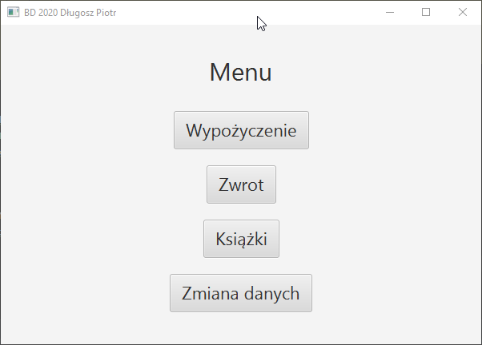

###Dokumentacja Projektu
1. **Spis treści**

   - [Dokumentacja procedur]()
       1. [GETPRACOWNIK]()

   - [Dokumentacja widoków]()
       1. [Panel logowania]()
       1. [Menu]()

1. **Procedury**

   - **GETPRACOWNIK**   
   Procedura zwraca dane pracownika o ile istnieje pracownik z podanym loginem i hasłem.

        ```sql
        create or replace NONEDITIONABLE PROCEDURE "GETPRACOWNIK" 
        (d_login IN pracownicy.login%TYPE,d_haslo IN pracownicy.haslo%TYPE,data OUT SYS_REFCURSOR)
        AS
        BEGIN
            OPEN data FOR
                Select 
                    ID_PRACOWNIKA ,
                    IMIE ,
                    NAZWISKO ,
                    PESEL ,
                    DATA_URODZENIA ,
                    ID_ADRESU ,
                    LOGIN ,
                    HASLO  
                from Pracownicy
                Where login=d_login AND haslo=d_haslo;
        END;
        ```
    - **GETKSIAZKI**  
    Procedura zwraca wszyskie książki.
        ```sql
        create or replace NONEDITIONABLE PROCEDURE "GETKSIAZKI" 
        (books OUT SYS_REFCURSOR)
        AS
        BEGIN
            OPEN books FOR
                Select 
                    *
                from ksiazki;
        END;
        ```
     - **GETWYPOZYCZENIAILOSC**  
     Zwraca ilość wypożyczeń książek.
     ```sql
       create or replace NONEDITIONABLE PROCEDURE "GETWYPOZYCZENIAILOSC" 
       (id_ksiazki IN NUMBER,ilosc OUT NUMBER)
       AS
       BEGIN
           Select
               count(id_ksiazki)
           into
               ilosc
           from 
               wypozyczenia;
       END;
     ```
    - **GETWYDAWNICTWA**   
    Procedura zwraca wszystkie wydawnictwa.
     ```sql
       create or replace NONEDITIONABLE PROCEDURE "GETWYDAWNICTWA" 
       (wydawnictwaData OUT SYS_REFCURSOR)
       AS
       BEGIN
           OPEN wydawnictwaData FOR
               Select 
                   *
               from wydawnictwa;
       END;
    ```
   - **GETTAGI**   
   Procedura zwraca wszystkie tagi.
     ```sql
       create or replace NONEDITIONABLE PROCEDURE "GETTAGI" 
       (tagiData OUT SYS_REFCURSOR)
       AS
       BEGIN
           OPEN tagiData FOR
               Select 
                   *
               from tag;
       END;
     ```
   - **GETAUTORZY**  
        Procedura zwraca wszystkich autorów.
      ```sql
        create or replace NONEDITIONABLE PROCEDURE "GETAUTORZY" 
        (autorzyData OUT SYS_REFCURSOR)
        AS
        BEGIN
            OPEN autorzyData FOR
                Select 
                    *
                from autorzy;
        END;
      ```
   - **INSERTTAG**  
        Procedura wstawia tag do tabeli.
     ```sql
        create or replace NONEDITIONABLE PROCEDURE "INSERTTAG" 
        (nazwaTagu IN VARCHAR2)
        AS
        BEGIN
            INSERT INTO tag (id_tagu,nazwa)
            VALUES (TAG_INCREMENT.nextval,nazwatagu);
            commit;
        END;
     ```
1. **Widoki**
   - **Panel logowania**  
    Wykorzystuję procedurę ["GETPRACOWNIK"](). Dane pracownika zapisuje do pamięci.  
    
        
    
   - **Menu**   
    Zawiera przyciski do korzystania z różnych funkcjonalności projektu. 
      
        
        
   - **Menu**