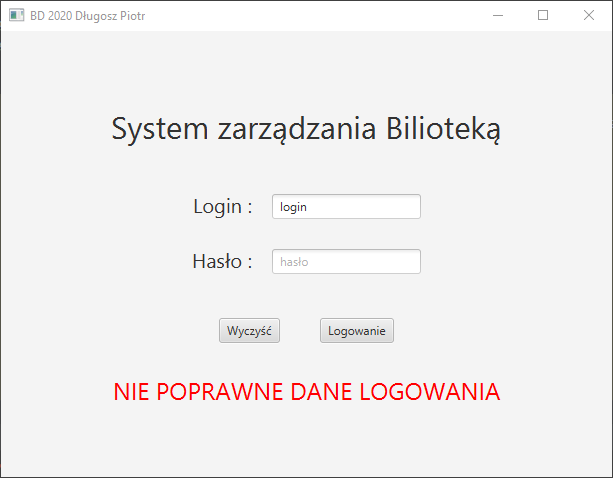

###Dokumentacja Projektu
1. Spis treści

   - [Dokumentacja procedur]()
       1. [GETPRACOWNIK]()

   - [Dokumentacja widoków]()
       1. [Panel logowania]()
       1. [Menu]()

1. Procedury

   - **GETPRACOWNIK**   
   Procedura zwraca dane pracownika o ile istnieje pracownik z podanym loginem i hasłem.

        ```sql
        create or replace NONEDITIONABLE PROCEDURE "GETPRACOWNIK" 
        (d_login IN pracownicy.login%TYPE,d_haslo IN pracownicy.haslo%TYPE,data OUT SYS_REFCURSOR)
        AS
        BEGIN
            OPEN data FOR
                Select 
                    ID_PRACOWNIKA ,
                    IMIE ,
                    NAZWISKO ,
                    PESEL ,
                    DATA_URODZENIA ,
                    ID_ADRESU ,
                    LOGIN ,
                    HASLO  
                from Pracownicy
                Where login=d_login AND haslo=d_haslo;
        END;
        ```
  
1. Widoki
   - **Panel logowania**  
    Wykorzystuję procedurę ["GETPRACOWNIK"](). Dane pracownika zapisuje do pamięci.  
    
        
    
   - **Menu**   
    Zawiera przyciski do korzystania z różnych funckjonalności projektu. 
      
        