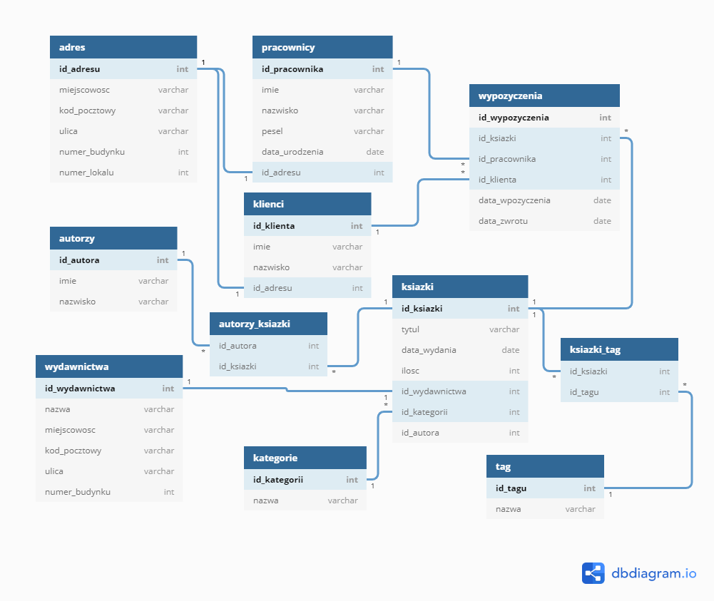

## Projekt bazy danych Biblioteki w PostgreSQL
#### Autor
Piotr Długosz 2 rok informatyki labolatoria 1 Uniwersytet Rzeszowski
#### Założenia
Wykonanie pełnego funkcjonalnego oprogramowania z interfejsem graficznym wykorzystując Bazę danych Oracle PL/SQL.
#### Opis
Baza przechowuje informację na temat książek, autorów, wydawnictw, klientów, pracowników, wypożyczeń.
#### Relacje
Każdy pracownik, klient posiada jeden adres.   
Wiele klientów, pracowników może posiadać jeden adres.  
Każdy pracownik, klient może uczestniczyć w wielu wypożyczeniach.  
Każda książka może zostać wypożyczona wiele razy.  
Każda książka posiada jedno wydawnictwo, kategorię.  
Każda książka może zawierać wiele autorów, tagów.  
#### Schemat ERD



#### Zmapowane obiekty w hibernate

[Adres](https://github.com/piotranon/BD_2020_DlugoszPiotr/blob/5ec9a7fb946c9ab7cfd4f8f40856304629181e05/DB/src/main/java/entity/Adres.java#L8), [Autorzy](https://github.com/piotranon/BD_2020_DlugoszPiotr/blob/5ec9a7fb946c9ab7cfd4f8f40856304629181e05/DB/src/main/java/entity/Autorzy.java#L8), [Kategorie](https://github.com/piotranon/BD_2020_DlugoszPiotr/blob/5ec9a7fb946c9ab7cfd4f8f40856304629181e05/DB/src/main/java/entity/Kategorie.java#L8), [Klienci](https://github.com/piotranon/BD_2020_DlugoszPiotr/blob/5ec9a7fb946c9ab7cfd4f8f40856304629181e05/DB/src/main/java/entity/Klienci.java#L8), [Ksiazki](https://github.com/piotranon/BD_2020_DlugoszPiotr/blob/5ec9a7fb946c9ab7cfd4f8f40856304629181e05/DB/src/main/java/entity/Ksiazki.java#L10), [Pracownicy](https://github.com/piotranon/BD_2020_DlugoszPiotr/blob/5ec9a7fb946c9ab7cfd4f8f40856304629181e05/DB/src/main/java/entity/Pracownicy.java#L9), [Tag](https://github.com/piotranon/BD_2020_DlugoszPiotr/blob/5ec9a7fb946c9ab7cfd4f8f40856304629181e05/DB/src/main/java/entity/Tag.java#L8), [Wydawnictwa](https://github.com/piotranon/BD_2020_DlugoszPiotr/blob/5ec9a7fb946c9ab7cfd4f8f40856304629181e05/DB/src/main/java/entity/Wydawnictwa.java#L8), [Wypozyczenia](https://github.com/piotranon/BD_2020_DlugoszPiotr/blob/5ec9a7fb946c9ab7cfd4f8f40856304629181e05/DB/src/main/java/entity/Wypozyczenia.java#L9)

#### PLSQL
  (Linki jeszcze nie działaja ale niżej można podejrzeć wygląd procedur)   
  1. Tabela   
    [pracownicy](),[klienci](),[adres](),[ksiazki](),[ksiazki_tag](),[tag](),[wydawnictwa](),[autorzy](),[autorzy_ksiazki](),[kategorie](),[wypozyczenia]()
  1. Procedury   
     * Pobierające   
        [GETADRES](),[GETPRACOWNIK](),[GETTAGI](),[GETAUTORZY](),[GETKATEGORIE](),[GETWYDAWNICTWA](),   
     * Dodające   
        [ADDAUTOR](),[ADDKATEGORIA](),[ADDTAG](),
  1. Sekwencje  
     * inkrementacyjne  
        [adres_increment](),[autorzy_increment](),[kategorie_increment](),[klienci_increment](),[ksiazki_increment](),[pracownicy_increment](),[tag_increment](),[wydawnictwa_increment](),[wypozyczenia_increment]()
#### PLSQL Tabeli
```PL/SQL
CREATE TABLE pracownicy (
    id_pracownika int PRIMARY KEY,
    imie varchar(255),
    nazwisko varchar(255),
    pesel varchar(255),
    data_urodzenia date,
    id_adresu int,
    login varchar(255) UNIQUE,
    haslo varchar(255)
);
```
```PL/SQL
CREATE TABLE klienci (
    id_klienta int PRIMARY KEY,
    imie varchar(255),
    nazwisko varchar(255),
    id_adresu int
);
```
```PL/SQL
CREATE TABLE adres (
    id_adresu int PRIMARY KEY,
    miejscowosc varchar(255),
    kod_pocztowy varchar(255),
    ulica varchar(255),
    numer_budynku int
);
```
```PL/SQL
CREATE TABLE ksiazki (
    id_ksiazki int PRIMARY KEY,
    tytul varchar(255),
    data_wydania date,
    ilosc int,
    id_wydawnictwa int,
    id_kategorii int,
);
```
```PL/SQL
CREATE TABLE ksiazki_tag (
    id_ksiazki int,
    id_tagu int
);
```
```PL/SQL
CREATE TABLE tag (
    id_tagu int PRIMARY KEY,
    nazwa varchar(255)
);
```
```PL/SQL
CREATE TABLE wydawnictwa (
    id_wydawnictwa int PRIMARY KEY,
    nazwa varchar(255),
    id_adresu int UNIQUE
);
```
```PL/SQL
CREATE TABLE autorzy (
    id_autora int PRIMARY KEY,
    imie varchar(255),
    nazwisko varchar(255)
);
```
```PL/SQL
CREATE TABLE autorzy_ksiazki (
    id_autora int,
    id_ksiazki int
);
```
```PL/SQL
CREATE TABLE kategorie (
    id_kategorii int PRIMARY KEY,
    nazwa varchar(255)
);
```
```PL/SQL
CREATE TABLE wypozyczenia (
    id_wypozyczenia int PRIMARY KEY,
    id_ksiazki int,
    id_pracownika int,
    id_klienta int,
    data_wpozyczenia date,
    data_zwrotu date
);
```
```PL/SQL
ALTER TABLE pracownicy ADD CONSTRAINT pracownik_adres FOREIGN KEY (id_adresu) REFERENCES adres (id_adresu);
    
ALTER TABLE klienci ADD CONSTRAINT klient_adres FOREIGN KEY (id_adresu) REFERENCES adres (id_adresu);
    
ALTER TABLE wydawnictwa ADD CONSTRAINT wydawnictwo_adres FOREIGN KEY (id_adresu) REFERENCES adres (id_adresu);
    
ALTER TABLE wypozyczenia ADD CONSTRAINT wypozyczenia_pracownik FOREIGN KEY (id_pracownika) REFERENCES pracownicy (id_pracownika);
ALTER TABLE wypozyczenia ADD CONSTRAINT wypozyczenia_klient FOREIGN KEY (id_klienta) REFERENCES klienci (id_klienta);
ALTER TABLE wypozyczenia ADD CONSTRAINT wypozyczenia_ksiazka FOREIGN KEY (id_ksiazki) REFERENCES ksiazki (id_ksiazki);
    
ALTER TABLE ksiazki ADD CONSTRAINT ksiazki_wypozyczenia FOREIGN KEY (id_ksiazki) REFERENCES wypozyczenia (id_ksiazki);
ALTER TABLE ksiazki ADD CONSTRAINT ksiazka_wydawnictwo FOREIGN KEY (id_wydawnictwa) REFERENCES wydawnictwa (id_wydawnictwa);
ALTER TABLE ksiazki ADD CONSTRAINT ksiazka_kategoria FOREIGN KEY (id_kategorii) REFERENCES kategorie (id_kategorii);
    
ALTER TABLE ksiazki_tag ADD CONSTRAINT tag_ksiazka FOREIGN KEY (id_ksiazki) REFERENCES ksiazki (id_ksiazki);
ALTER TABLE ksiazki_tag ADD CONSTRAINT ksiazka_tag2 FOREIGN KEY (id_tagu) REFERENCES tag (id_tagu);
    
ALTER TABLE autorzy_ksiazki ADD CONSTRAINT autorzy_ksiazka FOREIGN KEY (id_autora) REFERENCES autorzy (id_autora);
ALTER TABLE autorzy_ksiazki ADD CONSTRAINT ksiazka_autorzy FOREIGN KEY (id_ksiazki) REFERENCES ksiazki (id_ksiazki);
 ```
#### PLSQL Procedury
   1.  Procedura "ADDAUTOR" służy do utworzenia nowego autora w bazie danych.
        ```PL/SQL
        create or replace NONEDITIONABLE PROCEDURE "ADDAUTOR" 
        (imie IN VARCHAR2, nazwisko IN VARCHAR2)
        AS
        BEGIN
            INSERT INTO autorzy(id_autora,imie,nazwisko) VALUES (AUTORZY_INCREMENT.nextval,imie,nazwisko);
        END;
        ```
   1.  Procedura "ADDKATEGORIA" służy do utworzenia nowej kategorii w bazie danych.
        ```PL/SQL
        create or replace NONEDITIONABLE PROCEDURE "ADDKATEGORIA" 
        (nazwa IN VARCHAR2)
        AS
        BEGIN
            INSERT INTO kategorie(id_kategorii,nazwa) VALUES (KATEGORIE_INCREMENT.nextval,nazwa);
        END;
        ```
   1.  Procedura "ADDTAG" służy do utworzenia nowego tagu w bazie danych.
        ```PL/SQL
        create or replace NONEDITIONABLE PROCEDURE "ADDTAG" 
        (nazwaTagu IN VARCHAR2)
        AS
        BEGIN
            INSERT INTO tag VALUES (TAG_INCREMENT.nextval,nazwaTagu);
        END;
        ```
   1.  Procedura "GETADRES" zwraca dane dotyczące adresu o określonym id.
        ```PL/SQL
        create or replace NONEDITIONABLE PROCEDURE "GETADRES" 
        (d_id IN adres.id_adresu%TYPE,data OUT SYS_REFCURSOR)
        AS
        BEGIN
            OPEN data FOR
                Select 
                    ID_ADRESU ,
                    MIEJSCOWOSC ,
                    KOD_POCZTOWY ,
                    ULICA ,
                    NUMER_BUDYNKU 
                from Adres
                Where id_adresu=d_id;
        END;
        ```
   1.  Procedura "GETPRACOWNIK" zwraca informacje odnośnie pracownika o ile podany login i hasło są poprawne.
        ```PL/SQL
        create or replace NONEDITIONABLE PROCEDURE "GETPRACOWNIK" 
        (d_login IN pracownicy.login%TYPE,d_haslo IN pracownicy.haslo%TYPE,data OUT SYS_REFCURSOR)
        AS
        BEGIN
            OPEN data FOR
                Select 
                    ID_PRACOWNIKA ,
                    IMIE ,
                    NAZWISKO ,
                    PESEL ,
                    DATA_URODZENIA ,
                    ID_ADRESU ,
                    LOGIN ,
                    HASLO  
                from Pracownicy
                Where login=d_login AND haslo=d_haslo;
        END;
        ```
   1. Procedura "GETTAGI" zwraca wszystkie tagi z bazy danych.
        ```PL/SQL
        create or replace NONEDITIONABLE PROCEDURE "GETTAGI" 
        (tagiData OUT SYS_REFCURSOR)
        AS
        BEGIN
            OPEN tagiData FOR
                Select 
                    *
                from tag;
        END;
        ```
   1. Procedura "GETAUTORZY" zwraca wszystkich autorów z bazy danych.
        ```PL/SQL
        create or replace NONEDITIONABLE PROCEDURE "GETAUTORZY" 
        (autorzyData OUT SYS_REFCURSOR)
        AS
        BEGIN
            OPEN autorzyData FOR
                Select 
                    *
                from autorzy;
        END;
        ```
   1. Procedura "GETKATEGORIE" zwraca wszystkie kategorie z bazy danych.
        ```PL/SQL
        create or replace NONEDITIONABLE PROCEDURE "GETKATEGORIE" 
        (kategorieData OUT SYS_REFCURSOR)
        AS
        BEGIN
            OPEN kategorieData FOR
                Select 
                    *
                from kategorie;
        END;
        ```
   1. Procedura "GETWYDAWNICTWA" zwraca wszystkie wudawnictwa z bazy danych.
        ```PL/SQL
        create or replace NONEDITIONABLE PROCEDURE "GETWYDAWNICTWA" 
        (wydawnictwaData OUT SYS_REFCURSOR)
        AS
        BEGIN
            OPEN wydawnictwaData FOR
                Select 
                    *
                from wydawnictwa;
        END;
        ```
#### PLSQL Sekwencje
   1. Sekwencja "adres_increment" służy do inkrementacji id przy dodawaniu nowych wierszy do tabeli. 
        ```PL/SQL
        Create sequence adres_increment start with 1
        increment by 1;
        ```
   1. Sekwencja autorzy_increment" służy do inkrementacji id przy dodawaniu nowych wierszy do tabeli. 
        ```PL/SQL
        Create sequence autorzy_increment start with 1
        increment by 1;
        ```
   1. Sekwencja "kategorie_increment" służy do inkrementacji id przy dodawaniu nowych wierszy do tabeli. 
        ```PL/SQL
        Create sequence kategorie_increment start with 1
        increment by 1;
        ```
   1. Sekwencja "klienci_increment" służy do inkrementacji id przy dodawaniu nowych wierszy do tabeli. 
        ```PL/SQL
        Create sequence klienci_increment start with 1
        increment by 1;
        ```
   1. Sekwencja "ksiazki_increment" służy do inkrementacji id przy dodawaniu nowych wierszy do tabeli. 
        ```PL/SQL
        Create sequence ksiazki_increment start with 1
        increment by 1;
        ```
   1. Sekwencja "pracownicy_increment" służy do inkrementacji id przy dodawaniu nowych wierszy do tabeli. 
        ```PL/SQL
        Create sequence pracownicy_increment start with 1
        increment by 1;
        ```
   1. Sekwencja "tag_increment" służy do inkrementacji id przy dodawaniu nowych wierszy do tabeli. 
        ```PL/SQL
        Create sequence tag_increment start with 1
        increment by 1;
        ```
   1. Sekwencja "wydawnictwa_increment" służy do inkrementacji id przy dodawaniu nowych wierszy do tabeli. 
        ```PL/SQL
        Create sequence wydawnictwa_increment start with 1
        increment by 1;
        ```
   1. Sekwencja "wypozyczenia_increment" służy do inkrementacji id przy dodawaniu nowych wierszy do tabeli. 
        ```PL/SQL
        Create sequence wypozyczenia_increment start with 1
        increment by 1;
        ```
