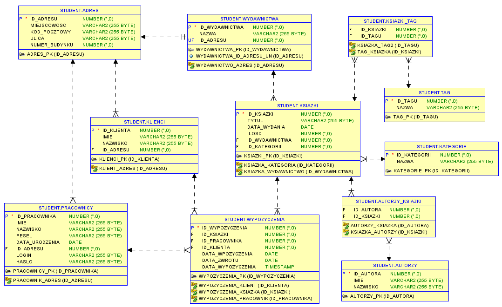

## Projekt bazy danych Biblioteki w PostgreSQL

#### Autor
Piotr Długosz 2 rok informatyki labolatoria 1 Uniwersytet Rzeszowski
#### Założenia
Wykonanie pełnego funkcjonalnego oprogramowania z interfejsem graficznym wykorzystując Bazę danych Oracle PL/SQL.
#### Opis
Baza przechowuje informację na temat książek, autorów, wydawnictw, klientów, pracowników, wypożyczeń.
#### Relacje
Każdy pracownik, klient posiada jeden adres.   
Wiele klientów, pracowników może posiadać jeden adres.  
Każdy pracownik, klient może uczestniczyć w wielu wypożyczeniach.  
Każda książka może zostać wypożyczona wiele razy.  
Każda książka posiada jedno wydawnictwo, kategorię.  
Każda książka może zawierać wiele autorów, tagów.  
#### [Dokumentacja Projektu](https://github.com/piotranon/BD_2020_DlugoszPiotr/blob/master/docs/Piotr%20D%C5%82ugosz%20Dokumentacja.docx)
#### Schemat ERD

#### Zmapowane obiekty w hibernate

[Adres](https://github.com/piotranon/BD_2020_DlugoszPiotr/blob/5ec9a7fb946c9ab7cfd4f8f40856304629181e05/DB/src/main/java/entity/Adres.java#L8), [Autorzy](https://github.com/piotranon/BD_2020_DlugoszPiotr/blob/5ec9a7fb946c9ab7cfd4f8f40856304629181e05/DB/src/main/java/entity/Autorzy.java#L8), [Kategorie](https://github.com/piotranon/BD_2020_DlugoszPiotr/blob/5ec9a7fb946c9ab7cfd4f8f40856304629181e05/DB/src/main/java/entity/Kategorie.java#L8), [Klienci](https://github.com/piotranon/BD_2020_DlugoszPiotr/blob/5ec9a7fb946c9ab7cfd4f8f40856304629181e05/DB/src/main/java/entity/Klienci.java#L8), [Ksiazki](https://github.com/piotranon/BD_2020_DlugoszPiotr/blob/5ec9a7fb946c9ab7cfd4f8f40856304629181e05/DB/src/main/java/entity/Ksiazki.java#L10), [Pracownicy](https://github.com/piotranon/BD_2020_DlugoszPiotr/blob/5ec9a7fb946c9ab7cfd4f8f40856304629181e05/DB/src/main/java/entity/Pracownicy.java#L9), [Tag](https://github.com/piotranon/BD_2020_DlugoszPiotr/blob/5ec9a7fb946c9ab7cfd4f8f40856304629181e05/DB/src/main/java/entity/Tag.java#L8), [Wydawnictwa](https://github.com/piotranon/BD_2020_DlugoszPiotr/blob/5ec9a7fb946c9ab7cfd4f8f40856304629181e05/DB/src/main/java/entity/Wydawnictwa.java#L8), [Wypozyczenia](https://github.com/piotranon/BD_2020_DlugoszPiotr/blob/5ec9a7fb946c9ab7cfd4f8f40856304629181e05/DB/src/main/java/entity/Wypozyczenia.java#L9)

#### [PLSQL (link) klikniej tu aby zobaczyc sql](https://github.com/piotranon/BD_2020_DlugoszPiotr/blob/master/docs/sql.md#sql-bazy-danych) 
#### [Export bazy danych z przykładowymi danymi](https://github.com/piotranon/BD_2020_DlugoszPiotr/blob/master/export.sql)
  
